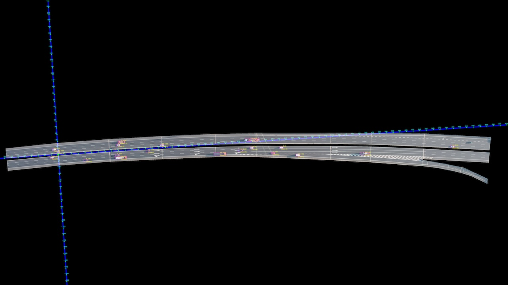

OpenVTER
===============
## Introduction

English | [简体中文](README_zh-CN.md)

OpenVTER is an open vehicle trajectory extraction framework based on rotated bounding boxes.
OpenVTER provides a full-stack vehicle trajectory extraction software that contains a video stabilization module, 
an image divide module, a rotated object detection module, a tracking module, and a data post-processing module. 
### Recommended system

* Intel i7 gen 9th - 14th / Intel i9 gen 9th - 14th / AMD ryzen 7 / AMD ryzen 9
* +16 GB RAM memory 
* NVIDIA RTX 2070 / NVIDIA RTX 2080 / NVIDIA RTX 3070, NVIDIA RTX 3080, NVIDIA RTX 3090
* Ubuntu 18.04

## Major Components


## License


This project is released under the [Apache 2.0 license](LICENSE).

## Getting Started

Please see [get_started.md](docs/en/get_started.md) for the basic usage of OpenVTER. 

### Trajectory connection

The code corresponding to the GCVTM paper is "./toolbox/trajectory_connection/multi_video_trajectory_connection.py"

## Citation

 If you are using our OpenVTER framework or codes for your development, please cite the following paper:

```
@article{ji2024openvter,
  author={Ji, Xinkai and Han, Yu and Mao, Peipei and Huang, Yan and Yu, Hao and Liu, Pan},
  journal={IEEE Transactions on Intelligent Transportation Systems}, 
  title={OpenVTER: An Open Vehicle Trajectory Extraction Framework Based on Rotated Bounding Boxes}, 
  year={2024},
  volume={},
  number={},
  pages={1-18},
  doi={10.1109/TITS.2024.3481256}}

@article{**,
  title   = {A Graph-Based Approach for Connecting Vehicle Trajectories from Multiple UAVs},
  author  = {Xinkai Ji},
  journal= {},
  year={}
}
```

## Author
### Xinkai Ji ([github](https://github.com/xinkaiji))
Ph.D. Candidate  
School of Transportation, Southeast University, China  
Email: xinkaiji@seu.edu.cn

## Demo
 
 